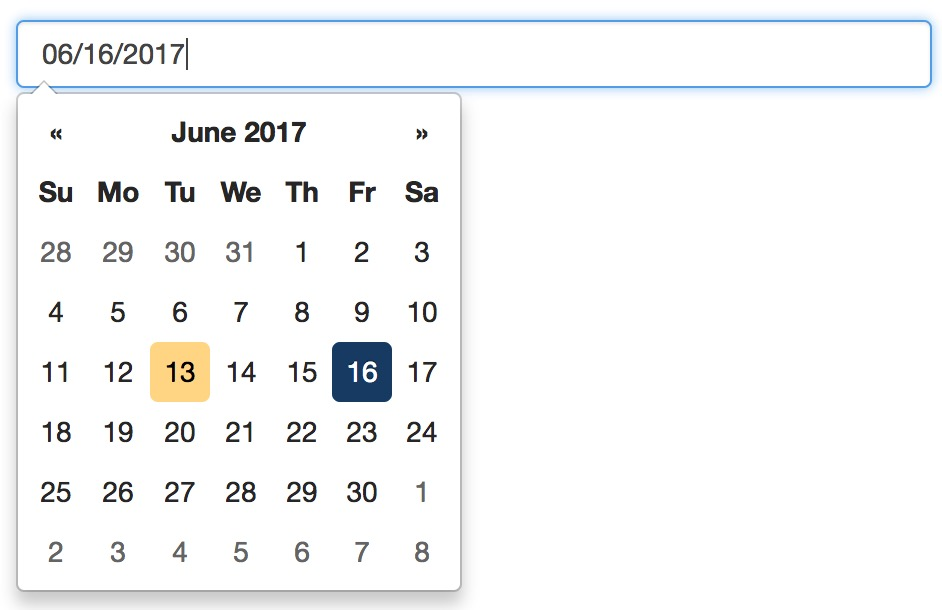
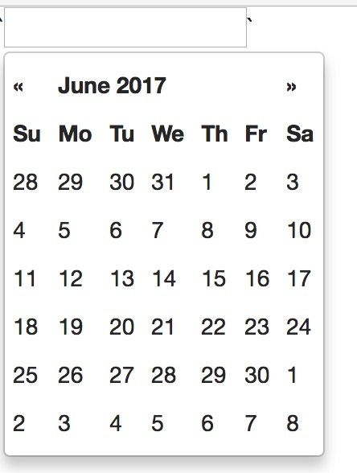

# bootstrap-datepicker
  - [官网文档](http://bootstrap-datepicker.readthedocs.io/en/stable/)  
  - [在线demo](https://uxsolutions.github.io/bootstrap-datepicker/)
  - [github地址](https://github.com/uxsolutions/bootstrap-datepicker)

## 它是什么?
  > 就是一个基于jquery和bootstrap样式的，用于选择日期的插件
  > 如图:  
  >   

## 如何使用?
  1. 下载bootstrap-datepicker
    + 使用npm下载: `npm install bootstrap-datepicker`

  2. 由于它依赖于jquery和bootstrap，所以还需要下载jquery和bootstrap
    + `npm install jquery bootstrap`

  3. 新建html引入`jquery`的js,和`bootstrap`的css文件,和bootstrap-datepicker对应的js和css

    ```html
    <!DOCTYPE html>
    <html lang="en">
    <head>
      <meta charset="UTF-8">
      <meta name="viewport" content="width=device-width, initial-scale=1.0">
      <meta http-equiv="X-UA-Compatible" content="ie=edge">
      <link rel="stylesheet" href="./node_modules/bootstrap/dist/css/bootstrap.css">
      <link href="./node_modules/bootstrap-datepicker/dist/css/bootstrap-datepicker.css">
      <title>bootstrap-datepicker</title>
    </head>
    <body>
      
    </body>
    </html>
    <script src="./node_modules/jquery/dist/jquery.js"></script>
    <script src="./node_modules/bootstrap-datepicker/dist/js/bootstrap-datepicker.js"></script>

    ```
    
  4. 在body中添加一个 input 标签
  `<input id="datepicker" >`
  
  5. 添加一些js代码
  > 引入bootstrap-datepicker.js之后, $.()就会多出一个datepicker方法  
  ```js
  $('#datepicker').datepicker()
  ```
  > 打开浏览器查看效果如图: 
  > 
  
## bootstrap-datepicker配置
  > 调用 `datepiker` 方法时可以传入一些参数，用于对其进行一些配置  
  > 如下: 
  ```js
  var options = {
    // 下面列出的属性都是可选的,不写行  
    format: 'yyyy-mm-dd', // 指展示的日期的格式 2017-12-3, yyyy年mm月dd日  2017年12月3日
    todayHighlight: true, // 默认为false, 为true时，弹出框中会显示当前日期。
    defaultViewDate: { year: 1977, month: 04, day: 25 }, // 设置弹出框中默认会显示的时间, 会使得todayHighlight: true 失效
    datesDisabled: ['06/06/2017', '06/21/2017'] // 设置哪些日期不可以选择,这里就是禁止选择6日与21日
  }
  $('#datepicker').datepicker(options)
  ```
> 详见示例demo/basic